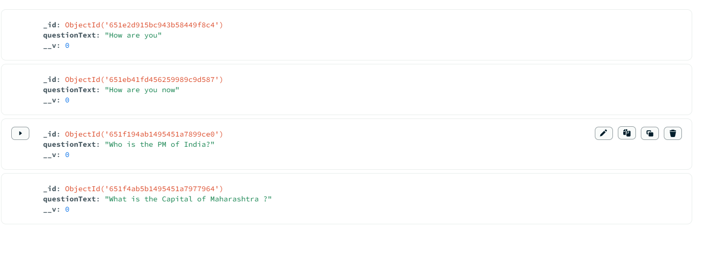

# Devheat_Beta_Heat_Up
# Answer Voyage

# 🧭 Table of contents

- [Community based Question Answer Website]()
- [🧭 Table of contents](#-table-of-contents)
- [Introduction](#introduction)
- [Quick Start](#quick-start)
- [Frontend](#frontend)
- [Backend](#backend)
- [Database](#database)
- [Future Aspirations for this App](#future-aspirations-for-this-app)

# Introduction

Our website is dedicated to fostering a supportive community where people come together to collaboratively solve problems and provide meaningful answers.

# Quick Start 

📄 Clone or fork this repo :
`https://github.com/sudarshan4718/Devheat_Beta_Heat_Up.git`:

```sh
git clone https://github.com/sudarshan4718/Devheat_Beta_Heat_Up.git
```

We need to install React in our folder.
npm create-react-app my-app


<br><br>
<br>


  

💿 Install all dependencies:
<br><br>
<br>

```sh
npm install
```

🚴‍♂️ Run your App:

```sh
cd AnswerVoyage/SignUpBackend
node index.js

And
cd AnswerVoyage/signuppage
npm start

```
Backend runs on the browser with localhost 9000.
```sh
http://localhost:9000/
```

React App runs on the browser with localhost 3000.
```sh
http://localhost:3000/
```
`In this Repo, in AnswerVoyage Folder,  SignUpBackend have backend codes and signuppage have frontend codes.`

# Frontend

 - React-Js<br>
 We have used Hooks like useEffect and useReact in this React App.
 We have used router-dom to create routes and path.
 - CSS<br>
 - We have made Register, Login page at first. <br>
<br><br>
 
 <br>
   We Added Navigation bar. In which, We have provided contacts, Sign in, Questions, Logout Features.<br>
 <br>
-This is our Contacts Page
<br><br>
<br>
This is our Question Display Page.<br><br>
 <br>
This is our Ask Questions page. In which you can ask your Questions.

   

  
# Backend

  At the `Backend` of this App, A `Nodejs` server is running, which manages all the `requests` and `responses` from the user. 
This App Uses Some Node_Modules in order to work properly which include:
- `Mongoose`
  - To make requests from the backend to MongoDB
- `cors`
    - allows a server to indicate any origins other than its own from which a browser should permit loading resources.
- `Express`
  - create a web-server
  - handles request and response
  - To connect Backend and Frontend.

# Database

We are using `MongoDB` for all its database needs. This App uses DB to:
 <br>
 <br>
 - Store information regarding the user.
 - Stores the password of the user. 
 - Stores the Question Asked by the user
 - Stores the Answer Given by the User

# Future Aspirations for this App

There are some features that can be added in the future:
- We can add Dashboard for the users, in which, No.of Questions Asked by the user will be displayed, and how many questions are answered till then.
- We can link the USername, Questions, and Answers and show it in our Page.
- We can add Comment Features for the Answers Uploaded.
- Users can add their Profile Picture and Bio.

  # Demonstration Video Link
  ```sh
  https://drive.google.com/file/d/1Bll8BIiiPSzD507kcESIFCt3U9EN6Nxy/view?usp=sharing
  ```
